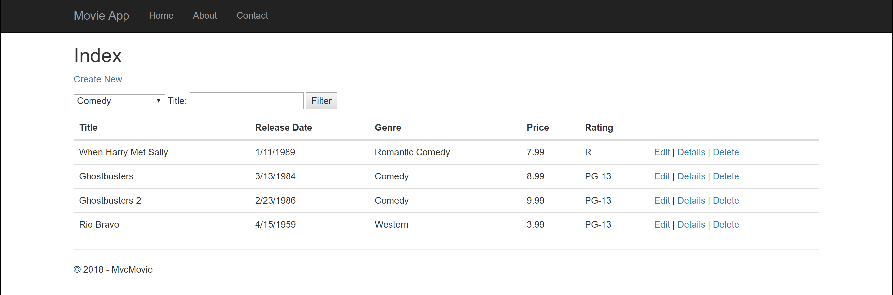

# Movie App

This Web Application is an exercise in Full Stack Development in the .NET Core framework,
originating from a Microsoft Docs tutorial.

Utilizing MVC Architecture and the Entity Framework

## Visual

## Usage

Clone this repository to local files.

Open Visual Studio

File > Open > Project/Solution

Navigate to where you saved this Repo in your local files

Open the "MvcMovie.sln" file

In the top menu, Click the IIS Express Button

A browser window should open,

Interact with the Web Application to Add, Delete, Update, and Search through an
movie list.